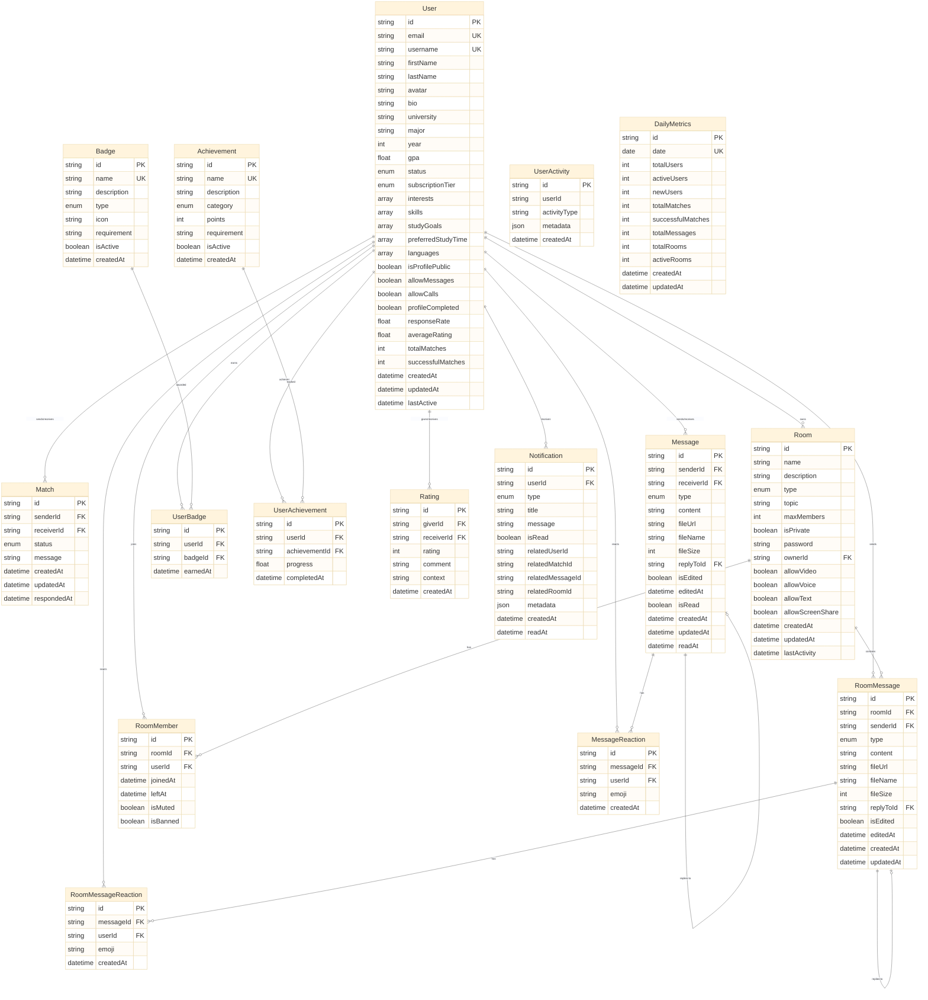

# StudyMate Database Schema Overview

## Entity Relationship Diagram

## Enums

### UserStatus
- `ACTIVE`
- `INACTIVE`
- `SUSPENDED`

### SubscriptionTier
- `BASIC`
- `PREMIUM`
- `ELITE`

### MatchStatus
- `PENDING`
- `ACCEPTED`
- `REJECTED`
- `BLOCKED`

### MessageType
- `TEXT`
- `FILE`
- `VOICE`
- `VIDEO`

### RoomType
- `STUDY_GROUP`
- `DISCUSSION`
- `HELP_SESSION`
- `CASUAL`

### BadgeType
- `NETWORK_PRO`
- `CHAT_MASTER`
- `STUDY_INFLUENCER`
- `MENTOR`
- `EARLY_ADOPTER`

### AchievementCategory
- `SOCIAL`
- `ACADEMIC`
- `ENGAGEMENT`
- `LEADERSHIP`

### NotificationType
- `MATCH_REQUEST`
- `MATCH_ACCEPTED`
- `NEW_MESSAGE`
- `ROOM_INVITE`
- `BADGE_EARNED`
- `ACHIEVEMENT_UNLOCKED`

## Table Groups

### 🧑‍🎓 User Management
- **User**: Core user profiles and settings
- **UserActivity**: Activity tracking and logging
- **DailyMetrics**: Platform-wide analytics

### 🤝 Matching System
- **Match**: Student-to-student connections
- **Rating**: Peer rating system

### 💬 Messaging System
- **Message**: Direct 1-on-1 messaging
- **MessageReaction**: Emoji reactions on direct messages

### 🏛️ Study Room System
- **Room**: Virtual study rooms
- **RoomMember**: Room membership tracking
- **RoomMessage**: Group chat messages
- **RoomMessageReaction**: Emoji reactions on room messages

### 🏆 Gamification System
- **Badge**: Predefined badges
- **UserBadge**: User-earned badges
- **Achievement**: Achievement definitions
- **UserAchievement**: User achievement progress

### 🔔 Notification System
- **Notification**: Real-time notifications

## Key Relationships

1. **User → Match**: Users can send and receive match requests (many-to-many)
2. **User → Message**: Users can send and receive direct messages (many-to-many)
3. **User → Room**: Users can own and join study rooms (one-to-many, many-to-many)
4. **Room → RoomMember**: Rooms have multiple members (one-to-many)
5. **Room → RoomMessage**: Rooms contain multiple messages (one-to-many)
6. **User → Badge/Achievement**: Users earn badges and unlock achievements (many-to-many)
7. **Message/RoomMessage → Reactions**: Messages can have multiple emoji reactions (one-to-many)
8. **Message/RoomMessage → Self**: Messages support threading via reply-to (self-referencing)

## Database Features

### Performance Optimizations
- Indexed fields for fast queries (user status, university, major, lastActive)
- Composite indexes for common query patterns
- Optimized message and notification queries

### Data Integrity
- Cascade deletion for user-related data
- Unique constraints on email, username, and relationships
- Foreign key constraints for referential integrity

### Scalability Features
- JSON metadata fields for flexible extensibility
- Array fields for multi-value attributes
- Separate analytics tables (UserActivity, DailyMetrics)
- Message reaction system supports unlimited emojis

### Real-time Capabilities
- Notification system with read status
- Message read receipts
- Room activity tracking
- Last active timestamps
